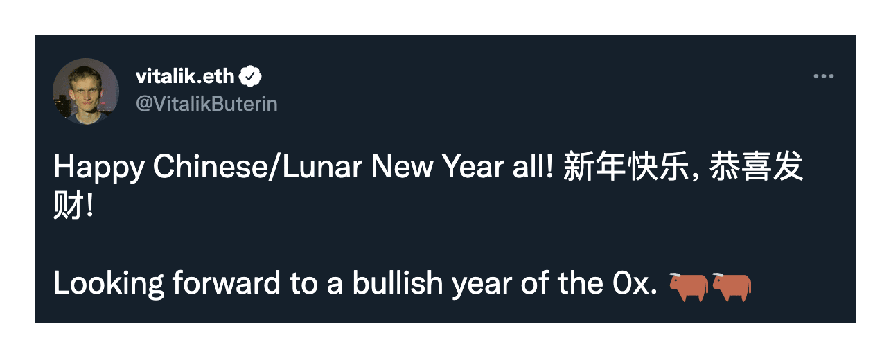

# The Year of the 0x

A simple twitter bot to collect the tweet data from all who participate in **#theyearofthe0x** hashtag.

The goal is to take a snapshot of the community in as organic a way as possible. The project is open ended. The initial goal is to create an interlinking node graph of individuals.

Ideally people will @ 1 or more people in the space they admire, relate to, are inspired by etc, so the snapshot extends further out than those that use the hashtag. Sub groups can include any hashtag they feel represents them as a community. ex. #nonbinary. Include any message they wish to leave in the tweet. Everyone is encouraged to include an ens or account address because... blockchain.

The collected data will be uploaded to this public repo. Who knows what can grow spontaneously in the space? Please help me take this group photograph of the current community.

To download repo and run independently please include a `.env` file with the following variables populated with your own twitter API keys.

    API=xxxxx
    API_SECRET=xxxxx
    ACCESS=xxxxx
    ACCESS_SECRET=xxxxx
